# Meeting Capture & Resolution Generator

A sophisticated legal-tech application built with Next.js that transforms meeting audio recordings or transcripts into formal, jurisdiction-compliant board meeting resolutions using AI.

## Key Features

### Fully Implemented
- **Audio File Upload** — Support for MP3, MP4, and WAV formats
- **Transcript File Upload** — Support for TXT, SRT, and VTT formats
- **AI Transcription** — OpenAI Whisper API integration for audio-to-text conversion
- **AI Resolution Generation** — Anthropic Claude API for generating formal board resolutions
- **Multi-Jurisdiction Support** — Ireland, India, UK, and USA (Delaware) with jurisdiction-specific legal language
- **Rich Text Editing** — TipTap-powered editor for resolution customization
- **PDF Export** — Puppeteer-based PDF generation with professional styling
- **Persistent Storage** — Supabase for database and file storage
- **Meeting Dashboard** — View, manage, and access previous meetings
- **API Monitoring** — Track API usage, costs, latency, and errors
- **Rate Limiting** — Configurable rate limiting for API endpoints

### Placeholder Features (UI Only)
- **Platform Integration** — Zoom, Teams, Google Meet connection UI exists but OAuth logic is not implemented (`components/meeting-capture-home/connect-platform.tsx`)

## Technology Stack

| Category | Technology |
|----------|------------|
| Framework | Next.js 16.1.5 (App Router) |
| Language | TypeScript |
| React | React 19 |
| Styling | Tailwind CSS 4 |
| UI Components | Radix UI + shadcn/ui |
| Rich Text Editor | TipTap |
| Database & Storage | Supabase |
| AI Transcription | OpenAI Whisper API |
| AI Generation | Anthropic Claude API (claude-3-5-haiku-latest) |
| PDF Generation | Puppeteer Core + @sparticuz/chromium |
| Unit Testing | Vitest + Testing Library |
| E2E Testing | Playwright |
| Icons | Lucide React, Phosphor Icons |

## Project Structure

```
next-app/
├── app/                              # Next.js App Router
│   ├── api/                          # API Routes
│   │   ├── generate-pdf/             # PDF generation endpoint
│   │   │   └── route.ts
│   │   ├── generate-resolution/      # AI resolution generation
│   │   │   └── route.ts
│   │   ├── meetings/                 # Meeting CRUD operations
│   │   │   ├── route.ts              # GET all, POST new
│   │   │   └── [id]/
│   │   │       └── route.ts          # GET, PUT single meeting
│   │   ├── monitoring/               # API monitoring endpoint
│   │   │   └── route.ts
│   │   ├── transcribe-audio/         # Audio transcription
│   │   │   └── route.ts
│   │   └── upload-audio/             # Audio file upload to storage
│   │       └── route.ts
│   ├── monitoring/                   # Monitoring dashboard page
│   │   └── page.tsx
│   ├── transcribe/                   # Main transcription workflow page
│   │   └── page.tsx
│   ├── globals.css                   # Global styles
│   ├── layout.tsx                    # Root layout
│   └── page.tsx                      # Home page (meeting list)
├── components/                       # React components
│   ├── meeting-capture-home/         # Home page components
│   │   ├── connect-platform.tsx      # Platform integration UI (placeholder)
│   │   ├── meeting-metadata-form.tsx # Meeting details form
│   │   ├── meetings/                 # Meeting list components
│   │   │   ├── cards.tsx
│   │   │   └── index.tsx
│   │   ├── navbar.tsx
│   │   └── upload.tsx                # Audio/transcript upload
│   ├── meeting-recording/            # Audio/transcription display
│   │   ├── audio-player.tsx
│   │   ├── content.tsx
│   │   ├── footer.tsx
│   │   ├── index.tsx
│   │   └── navbar.tsx
│   ├── resolution-preview/           # Resolution editor/preview
│   │   ├── content.tsx
│   │   ├── footer.tsx
│   │   ├── index.tsx
│   │   ├── navbar.tsx
│   │   └── toolbar.tsx               # TipTap toolbar
│   ├── shared/                       # Shared components
│   │   └── status-chip.tsx
│   ├── resolution-view.tsx           # Full resolution view
│   ├── transcription-display.tsx     # Transcription text display
│   └── ui/                           # UI primitives (shadcn)
│       ├── alert-dialog.tsx
│       ├── badge.tsx
│       ├── button.tsx
│       ├── calendar.tsx
│       ├── card.tsx
│       ├── combobox.tsx
│       ├── date-picker.tsx
│       ├── dropdown-menu.tsx
│       ├── error-state.tsx
│       ├── field.tsx
│       ├── input-group.tsx
│       ├── input.tsx
│       ├── label.tsx
│       ├── popover.tsx
│       ├── select.tsx
│       ├── separator.tsx
│       ├── skeleton.tsx
│       ├── sonner.tsx
│       ├── stage-indicator.tsx
│       └── textarea.tsx
├── hooks/                            # Custom React hooks
│   ├── use-audio.ts                  # Audio file handling
│   ├── use-meeting-workflow.ts       # Main orchestration hook
│   ├── use-meetings.ts               # Meeting data fetching
│   ├── use-monitoring.ts             # API monitoring
│   ├── use-resolution.ts             # Resolution generation
│   └── use-transcription.ts          # Audio transcription
├── lib/                              # Utility libraries
│   ├── api/                          # API client functions
│   │   ├── meetings.ts
│   │   ├── monitoring.ts
│   │   ├── pdf.ts
│   │   └── transcription.ts
│   ├── pdf/                          # PDF generation styles
│   │   └── styles.ts
│   ├── prompts/                      # AI prompt templates
│   │   ├── jurisdiction-config.ts    # Legal configurations per jurisdiction
│   │   ├── jurisdiction-templates.ts # Template text per jurisdiction
│   │   └── resolution-prompt.ts      # Main AI prompts
│   ├── utils/                        # Utility functions
│   │   ├── formatting.ts
│   │   └── transcript-parser.ts      # SRT/VTT parser
│   ├── validation/                   # Schema validation
│   │   └── meeting-schema.ts
│   ├── api-monitoring.ts             # API call tracking
│   ├── rate-limiter.ts               # Rate limiting
│   ├── resolution-html.ts            # HTML generation for resolutions
│   ├── supabase.ts                   # Database client
│   └── utils.ts                      # General utilities (cn, etc.)
├── types/                            # TypeScript types
│   ├── index.ts
│   ├── meeting.ts
│   ├── monitoring.ts
│   └── resolution.ts
├── public/                           # Static assets
├── tests/                            # Test files
│   ├── components/                   # Component tests
│   ├── integration/                  # Integration tests
│   └── unit/                         # Unit tests
└── Configuration files
    ├── package.json
    ├── tsconfig.json
    ├── next.config.ts
    ├── vitest.config.ts
    └── playwright.config.ts
```

## Architecture Overview

### System Architecture

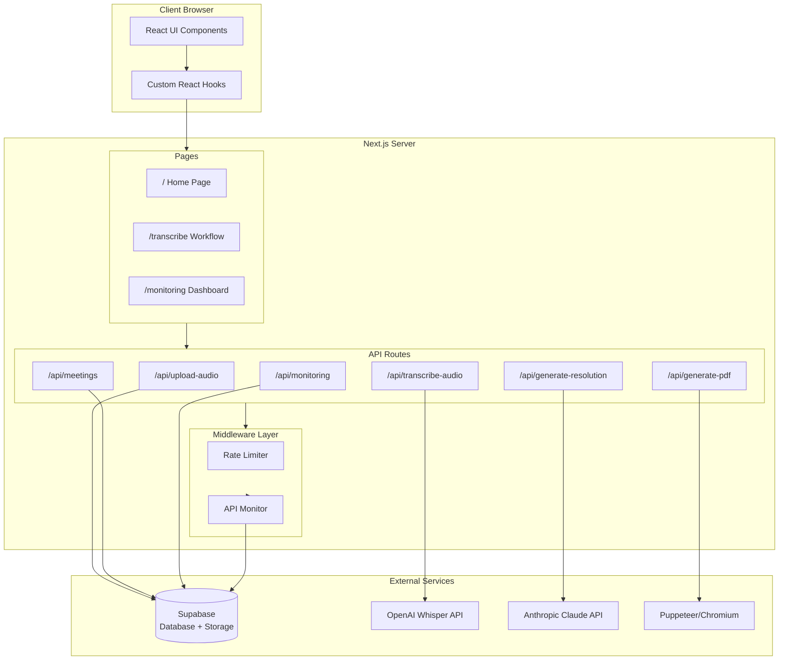

### Data Flow Diagram

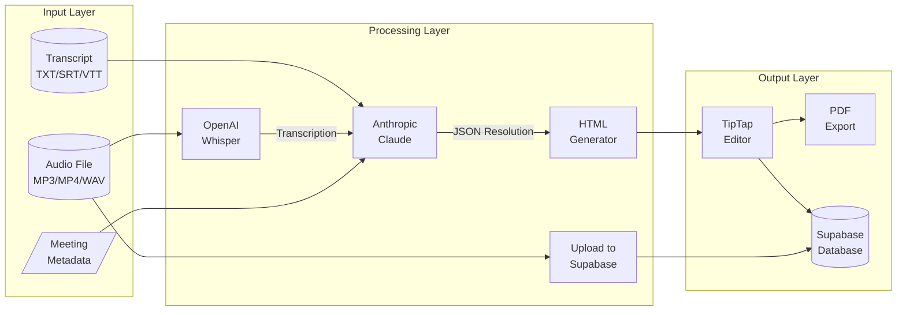

### User Journey

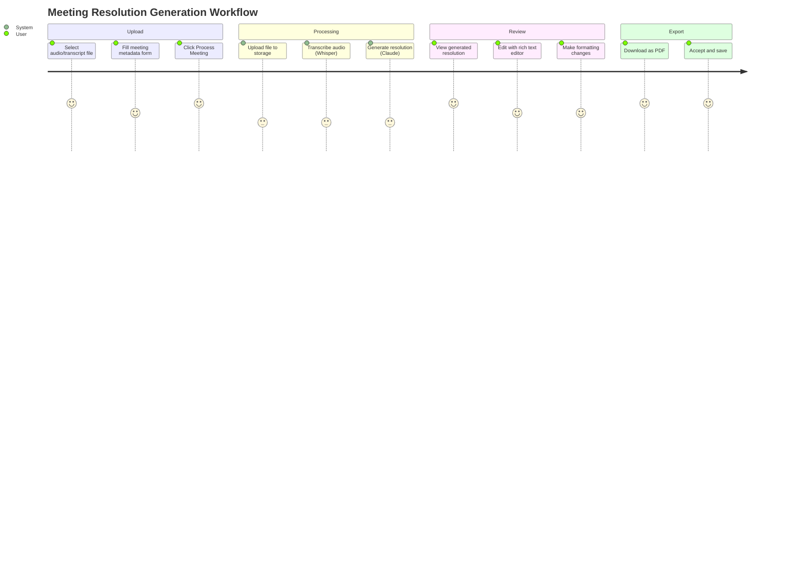

### Processing State Machine

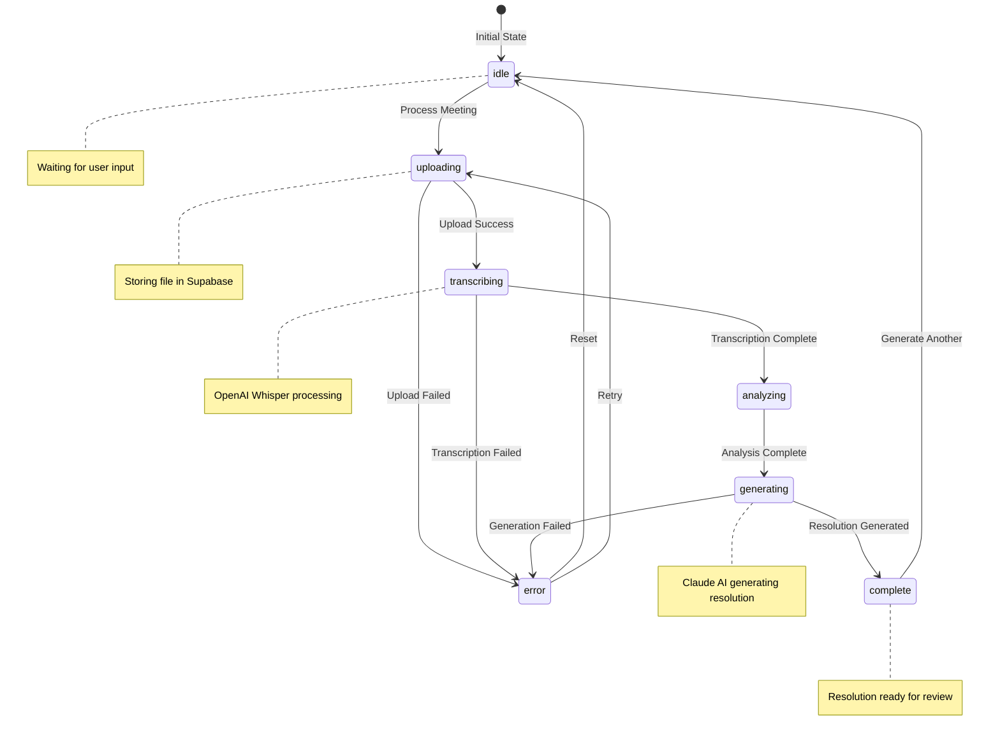

### Hook Composition Pattern

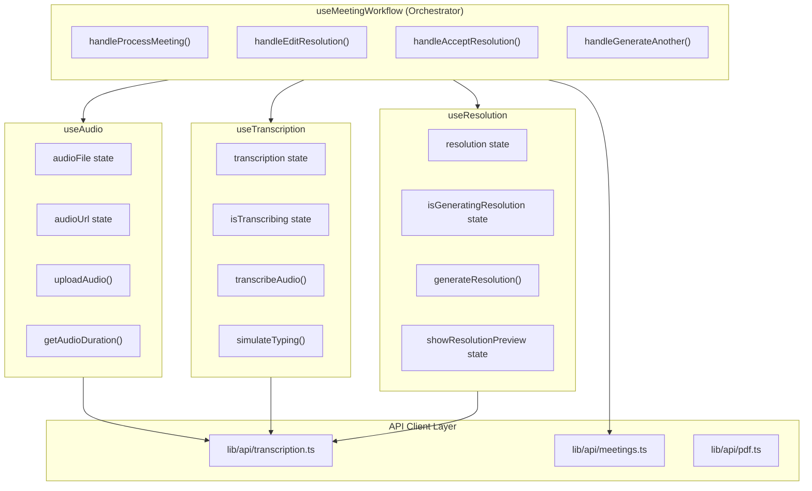

### User Workflow

1. **Upload** — User uploads an audio file (MP3/MP4/WAV) or transcript file (TXT/SRT/VTT)
2. **Metadata** — User fills in meeting details: entity name, date, time, jurisdiction, meeting type
3. **Process** — System uploads file to Supabase storage, transcribes audio (if applicable), generates resolution
4. **Review** — User reviews generated resolution in rich text editor
5. **Edit** — User can edit the resolution using TipTap editor with formatting toolbar
6. **Export** — User exports final resolution as PDF
7. **Save** — Resolution is persisted to Supabase database

### Processing Stages

The application tracks processing stages displayed to the user:
- `idle` — Waiting for user input
- `uploading` — Uploading file to storage
- `transcribing` — Transcribing audio via Whisper
- `analyzing` — Brief analysis stage
- `generating` — Generating resolution via Claude
- `complete` — Processing finished successfully
- `error` — An error occurred

## Setup Instructions

### Prerequisites

- Node.js 18+
- npm or yarn
- Supabase account
- OpenAI API key
- Anthropic API key
- Google Chrome (for local PDF generation)

### Environment Variables

Create a `.env.local` file with the following variables:

```bash
# Supabase
NEXT_PUBLIC_SUPABASE_URL=https://your-project.supabase.co
NEXT_PUBLIC_SUPABASE_ANON_KEY=your-anon-key
SUPABASE_SERVICE_ROLE_KEY=your-service-role-key

# OpenAI (for Whisper transcription)
NEXT_PUBLIC_OPENAI_API_KEY=sk-your-openai-key

# Anthropic (for Claude resolution generation)
NEXT_PUBLIC_CLAUDE_API_KEY=sk-ant-your-anthropic-key
```

### Supabase Setup

#### Database Schema

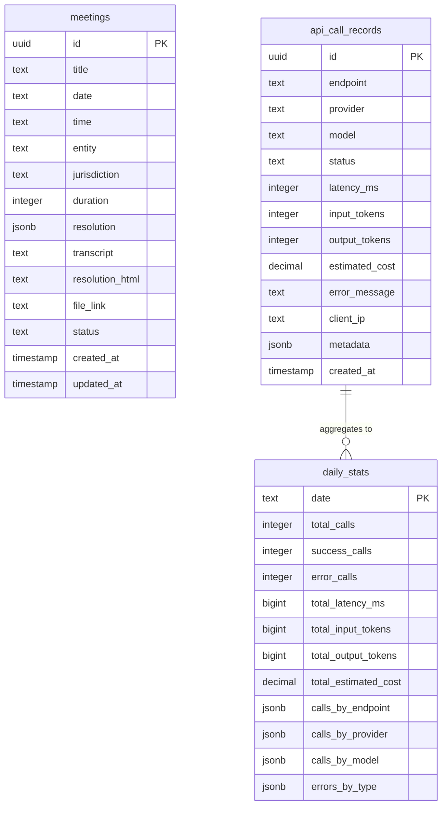

Create the following tables in your Supabase project:

**meetings**
```sql
create table meetings (
  id uuid default gen_random_uuid() primary key,
  title text not null,
  date text not null,
  time text,
  entity text not null,
  jurisdiction text not null,
  duration integer default 0,
  resolution jsonb default '{}',
  transcript text,
  resolution_html text,
  file_link text,
  status text default 'DRAFT',
  created_at timestamp with time zone default now(),
  updated_at timestamp with time zone default now()
);
```

**api_call_records** (for monitoring)
```sql
create table api_call_records (
  id uuid default gen_random_uuid() primary key,
  endpoint text not null,
  provider text not null,
  model text not null,
  status text not null,
  latency_ms integer not null,
  input_tokens integer,
  output_tokens integer,
  estimated_cost decimal,
  error_message text,
  client_ip text,
  metadata jsonb,
  created_at timestamp with time zone default now()
);
```

**daily_stats** (for monitoring aggregates)
```sql
create table daily_stats (
  date text primary key,
  total_calls integer default 0,
  success_calls integer default 0,
  error_calls integer default 0,
  total_latency_ms bigint default 0,
  total_input_tokens bigint default 0,
  total_output_tokens bigint default 0,
  total_estimated_cost decimal default 0,
  calls_by_endpoint jsonb default '{}',
  calls_by_provider jsonb default '{}',
  calls_by_model jsonb default '{}',
  errors_by_type jsonb default '{}'
);
```

**Storage bucket**
Create a storage bucket named `audio` for audio file uploads.

### Installation

```bash
# Install dependencies
npm install

# Run development server
npm run dev
```

The application runs on `http://localhost:8000` by default.

### Available Scripts

```bash
npm run dev          # Start development server (port 8000)
npm run build        # Build for production
npm run start        # Start production server
npm run lint         # Run ESLint
npm test             # Run unit tests (Vitest)
npm run test:ui      # Run unit tests with UI
npm run test:e2e     # Run E2E tests (Playwright)
npm run test:e2e:ui  # Run E2E tests with UI
```

## API Endpoints

### API Request Flow

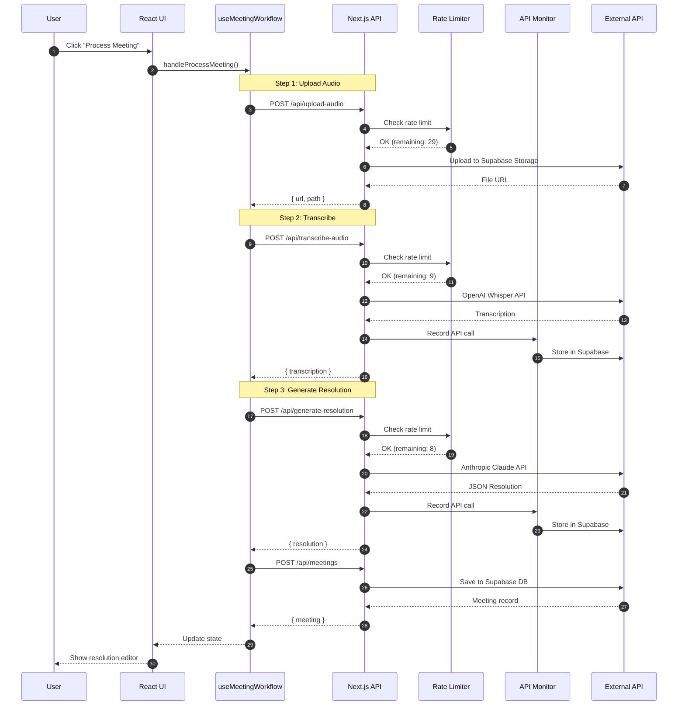

### POST /api/transcribe-audio

Transcribes audio files using OpenAI Whisper API.

**Request:** `multipart/form-data` with `file` field

**Response:**
```json
{
  "transcription": "[00:00:05] Welcome to the board meeting...",
  "rawData": { /* Whisper API response */ }
}
```

**Rate Limit:** 10 requests/minute (AI_STRICT tier)

---

### POST /api/generate-resolution

Generates board meeting resolutions using Anthropic Claude API.

**Request:**
```json
{
  "transcription": "The meeting transcription text...",
  "metadata": {
    "entityName": "Acme Corp Ltd",
    "jurisdiction": "Ireland",
    "meetingType": "Board Meeting",
    "meetingTitle": "Q4 2024 Board Meeting",
    "date": "2024-12-15",
    "time": "10:00"
  }
}
```

**Response:**
```json
{
  "resolution": {
    "entityName": "Acme Corp Ltd",
    "directors": [...],
    "approvalOfAgreement": [...],
    /* ... structured resolution data */
  }
}
```

**Rate Limit:** 10 requests/minute (AI_STRICT tier)

---

### POST /api/generate-pdf

Generates PDF from HTML resolution content.

**Request:**
```json
{
  "html": "<div class='resolution-document'>...</div>",
  "title": "Board Meeting Resolution"
}
```

**Response:** PDF file (application/pdf)

**Rate Limit:** 30 requests/minute (STANDARD tier)

---

### GET /api/meetings

Lists all meetings ordered by creation date (newest first).

**Response:**
```json
{
  "meetings": [
    {
      "id": "uuid",
      "title": "Q4 Board Meeting",
      "date": "2024-12-15",
      "entity": "Acme Corp",
      "jurisdiction": "Ireland",
      "status": "DRAFT"
    }
  ]
}
```

---

### POST /api/meetings

Creates a new meeting record.

**Request:**
```json
{
  "title": "Q4 Board Meeting",
  "date": "2024-12-15",
  "time": "10:00",
  "entity": "Acme Corp Ltd",
  "jurisdiction": "Ireland",
  "transcript": "Meeting transcript...",
  "resolution_html": "<div>...</div>",
  "status": "DRAFT"
}
```

---

### GET /api/meetings/[id]

Retrieves a single meeting by ID.

---

### PUT /api/meetings/[id]

Updates an existing meeting.

**Request:**
```json
{
  "resolution_html": "<div>Updated resolution...</div>",
  "status": "COMPLETED"
}
```

---

### POST /api/upload-audio

Uploads audio file to Supabase storage.

**Request:** `multipart/form-data` with `file` field

**Response:**
```json
{
  "url": "https://supabase.co/storage/v1/object/public/audio/...",
  "path": "audio/filename.mp3"
}
```

---

### GET /api/monitoring

Returns API monitoring statistics.

**Query Parameters:**
- `limit` — Number of recent calls to return (default: 50)

**Response:**
```json
{
  "summary": {
    "totalCalls": 150,
    "successRate": 98.5,
    "averageLatencyMs": 2500,
    "totalInputTokens": 50000,
    "totalOutputTokens": 25000
  },
  "today": { /* daily stats */ },
  "recentCalls": [ /* recent API calls */ ],
  "callsByEndpoint": { "transcribe-audio": 50, "generate-resolution": 100 },
  "callsByProvider": { "openai": 50, "anthropic": 100 },
  "topErrors": []
}
```

## Jurisdiction Support

### Resolution Generation Flow

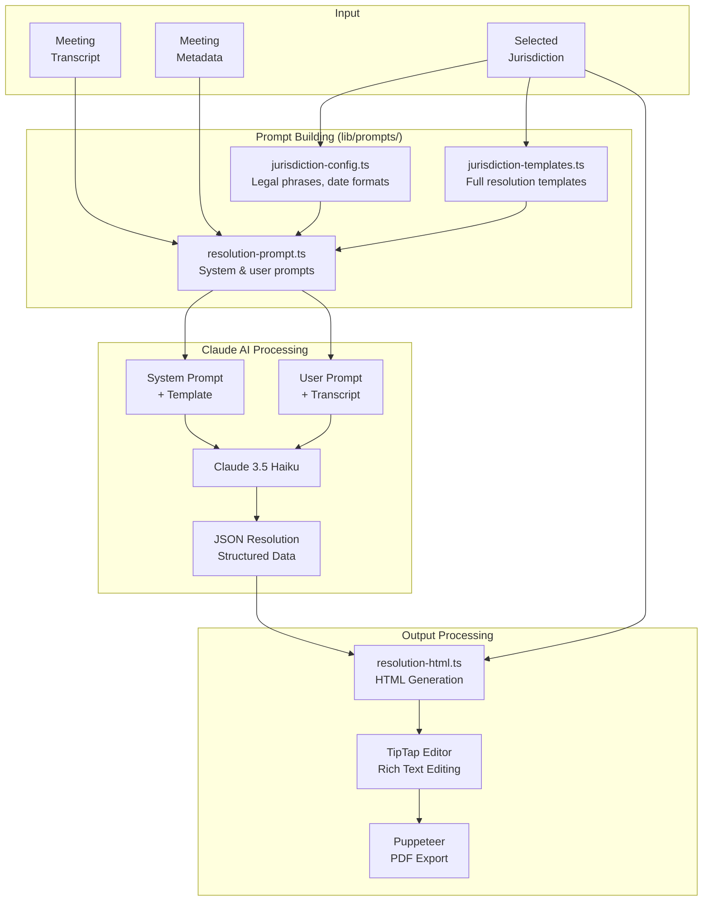

### Jurisdiction Configuration

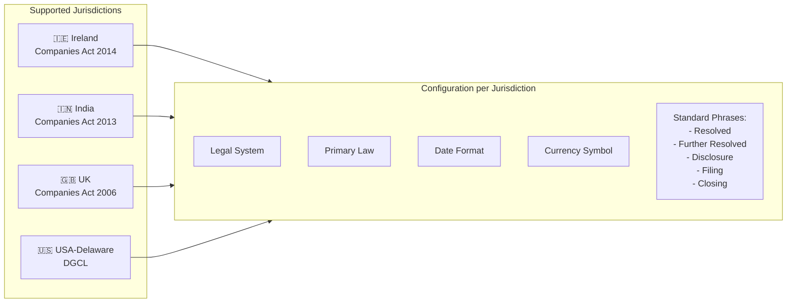

The application supports four jurisdictions with customized legal language and formatting:

| Jurisdiction | Legal System | Primary Law | Date Format | Currency |
|--------------|--------------|-------------|-------------|----------|
| Ireland | Irish Corporate Law | Companies Act 2014 | DD Month YYYY | € |
| India | Indian Corporate Law | Companies Act, 2013 | DD Month YYYY | ₹ |
| UK | UK Company Law | Companies Act 2006 | DD Month YYYY | £ |
| USA-Delaware | Delaware Corporate Law | DGCL | Month DD, YYYY | $ |

### Adding a New Jurisdiction

1. Add configuration in `lib/prompts/jurisdiction-config.ts`:
```typescript
'NewJurisdiction': {
  legalSystem: 'Jurisdiction corporate law',
  governingLaw: 'the Relevant Act',
  companyType: 'Jurisdiction companies',
  primaryLaw: 'The Relevant Act',
  region: 'Jurisdiction',
  dateFormat: 'DD Month YYYY',
  currencySymbol: '$',
  filingAuthority: 'Companies Registry',
  standardPhrases: {
    resolved: 'IT WAS RESOLVED that',
    furtherResolved: 'IT WAS FURTHER RESOLVED to',
    disclosure: 'Standard disclosure text...',
    filing: 'Standard filing instruction...',
    closing: 'Standard closing statement...',
  },
},
```

2. Add template in `lib/prompts/jurisdiction-templates.ts`

3. Update `getJurisdictionConfig()` partial matching if needed

## Hooks Documentation

### useMeetingWorkflow

**Location:** `hooks/use-meeting-workflow.ts`

The main orchestration hook that combines audio, transcription, and resolution hooks. Manages the complete meeting processing workflow including file upload, transcription, resolution generation, and database persistence.

**Key Functions:**
- `handleProcessMeeting()` — Orchestrates the full processing pipeline
- `handleTranscriptUpload()` — Handles direct transcript file uploads
- `handleEditResolution()` — Saves edited resolution to database
- `handleAcceptResolution()` — Marks meeting as completed

---

### useAudio

**Location:** `hooks/use-audio.ts`

Manages audio file state and upload to Supabase storage.

**Key Functions:**
- `uploadAudio(file)` — Uploads file to Supabase storage
- `getAudioDuration(file)` — Extracts audio duration from file

---

### useTranscription

**Location:** `hooks/use-transcription.ts`

Manages audio transcription with OpenAI Whisper API, including retry logic and typing effect.

**Key Functions:**
- `transcribeAudio(file)` — Transcribes audio with exponential backoff retry
- `simulateTyping()` — Provides typing effect for UX
- `retry()` — Retries last failed transcription

---

### useResolution

**Location:** `hooks/use-resolution.ts`

Manages resolution generation with Anthropic Claude API, including retry logic.

**Key Functions:**
- `generateResolution(text, metadata)` — Generates resolution from transcription
- `retry()` — Retries last failed generation

---

### useMeetings

**Location:** `hooks/use-meetings.ts`

Fetches and manages meeting list data from Supabase.

---

### useMonitoring

**Location:** `hooks/use-monitoring.ts`

Fetches API monitoring statistics with auto-refresh capability.

## UI Components

### Component Hierarchy

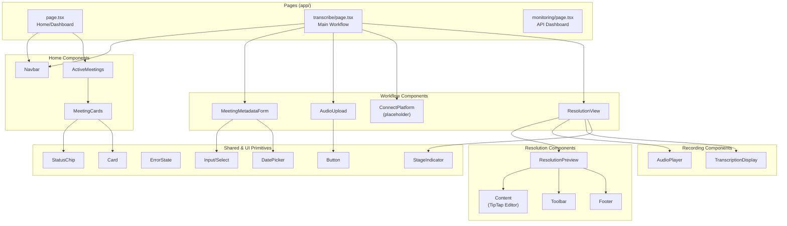

### Primitives (shadcn/ui)

| Component | Description |
|-----------|-------------|
| `button.tsx` | Versatile button with multiple variants (default, outline, ghost) and sizes |
| `card.tsx` | Container component for grouped content with header, content, footer sections |
| `input.tsx` | Standard text input field with consistent styling |
| `label.tsx` | Form label component for accessibility |
| `textarea.tsx` | Multi-line text input for longer content |
| `select.tsx` | Dropdown select component built on Radix UI |
| `combobox.tsx` | Searchable combobox for entity selection |
| `calendar.tsx` | Date picker calendar using react-day-picker |
| `date-picker.tsx` | Date picker wrapper with popover |
| `popover.tsx` | Popover container for floating content |
| `dropdown-menu.tsx` | Dropdown menu for actions |
| `alert-dialog.tsx` | Confirmation dialogs for destructive actions |
| `badge.tsx` | Status badges and labels |
| `separator.tsx` | Visual separator between content sections |
| `skeleton.tsx` | Loading placeholder animations |
| `sonner.tsx` | Toast notification system |
| `field.tsx` | Form field wrapper with label and error handling |
| `input-group.tsx` | Input with prefix/suffix addons |
| `error-state.tsx` | Error display component with retry option |
| `stage-indicator.tsx` | Processing stage indicator with spinner |

### Business Components

| Component | Description |
|-----------|-------------|
| `meeting-metadata-form.tsx` | Form for entering meeting details (entity, date, jurisdiction, etc.) |
| `upload.tsx` | Drag-and-drop upload zone for audio and transcript files |
| `connect-platform.tsx` | Platform integration UI (Zoom, Teams, Meet) - placeholder only |
| `meetings/index.tsx` | Meeting list container with data fetching |
| `meetings/cards.tsx` | Individual meeting card display |
| `resolution-view.tsx` | Full-page resolution view combining editor and audio player |
| `resolution-preview/content.tsx` | TipTap-powered rich text editor for resolutions |
| `resolution-preview/toolbar.tsx` | Formatting toolbar for the editor |
| `transcription-display.tsx` | Formatted transcription text with timestamps |
| `audio-player.tsx` | Audio playback component |
| `status-chip.tsx` | Status indicator chip (Draft, Complete, etc.) |

## Rate Limiting

### Rate Limit Flow

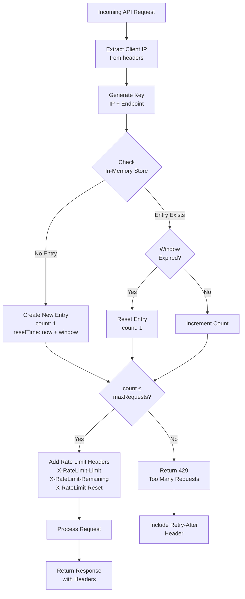

### Rate Limit Tiers

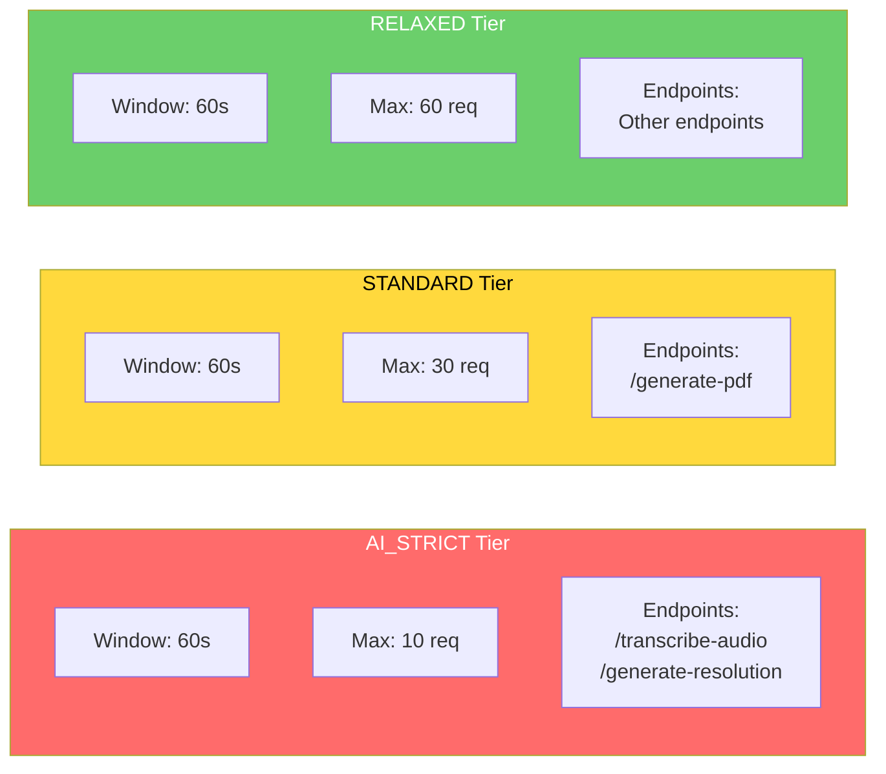

The application implements in-memory rate limiting with three tiers:

| Tier | Window | Max Requests | Used For |
|------|--------|--------------|----------|
| AI_STRICT | 1 minute | 10 | Transcription, Resolution generation |
| STANDARD | 1 minute | 30 | PDF generation |
| RELAXED | 1 minute | 60 | Other endpoints |

Rate limit headers are included in all responses:
- `X-RateLimit-Limit` — Maximum requests allowed
- `X-RateLimit-Remaining` — Requests remaining in window
- `X-RateLimit-Reset` — Window reset timestamp
- `Retry-After` — Seconds to wait (when rate limited)

## Testing

### Unit Tests (Vitest)

```bash
npm test              # Run once
npm run test:ui       # With UI
npm run test:coverage # With coverage report
```

### E2E Tests (Playwright)

```bash
npm run test:e2e      # Run headless
npm run test:e2e:ui   # With UI
```

## License

Private - All rights reserved.
